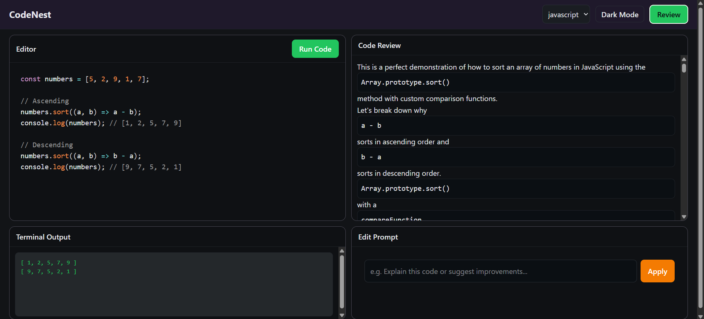

# CodeNest

<div align="center">
  
  <br />
  <h1>CodeNest</h1>
  <p><strong>AI-Powered Code Playground & Assistant</strong></p>
  <p>
    
    
    
    
  </p>
</div>

---

## 🚀 Overview

**CodeNest** is a modern, AI-enhanced code editor and playground that allows developers to write, execute, and review code in real-time. Built with a sleek React frontend and a robust Node.js backend, it integrates **Google Gemini 2.5 Flash** to provide instant, intelligent code reviews and natural language code modifications.

Whether you're learning a new language, debugging a script, or just experimenting, CodeNest provides a seamless environment with syntax highlighting, multiple language support, and AI assistance.

## ✨ Key Features

- **🌐 Multi-Language Support**: Write and execute code in **JavaScript**, **Python**, **Java**, and **C**.
- **🤖 AI Code Review**: Get instant, actionable feedback on your code structure, logic, and style efficiently powered by Google Gemini.
- **✨ AI Code Editing**: Modify your code using natural language prompts (e.g., "Convert this function to use async/await").
- **⚡ Real-Time Execution**: Run code securely and see output instantly in the built-in terminal.
- **🎨 Modern UI**: Beautiful dark-themed interface with **PrismJS** syntax highlighting and **Markdown** rendering.
- **🌓 Adaptive Themes**: Toggle between light and dark modes (defaulting to a developer-friendly dark mode).

## 🛠️ Tech Stack

### Frontend
- **Framework**: React 19 + Vite 7
- **Styling**: Vanilla CSS (Custom properties & CSS Grid)
- **Editor**: `react-simple-code-editor` + `prismjs`
- **Markdown**: `react-markdown` + `rehype-highlight`
- **State/Theme**: `use-dark-mode`

### Backend
- **Server**: Node.js + Express 5
- **AI Integration**: `@google/genai` (Gemini 2.5 Flash)
- **Execution**: Node.js `child_process` (supports Node, Python, JVM, GCC)
- **Utilities**: `cors`, `dotenv`

## ⚙️ Prerequisites

Before running CodeNest, ensure you have the following installed:

1. **Node.js** (v18 or higher recommended)
2. **Global Compilers** (for language support):
   - **Python** (for Python support)
   - **JDK** (Java Development Kit for Java support)
   - **GCC** (GNU Compiler Collection for C support)
3. A **Google Gemini API Key** (Get one from [Google AI Studio](https://aistudio.google.com/))

## 📦 Installation

Clone the repository to your local machine:

```bash
git clone https://github.com/your-username/CodeNest.git
cd CodeNest
```

### 1. Backend Setup

Navigate to the backend directory and install dependencies:

```bash
cd Backend
npm install
```

Create a `.env` file in the `Backend` directory and add your Gemini API key:

```env
GOOGLE_GEMINI_KEY=your_actual_api_key_here
```

Start the backend server:

```bash
node server.js
# Server runs on http://localhost:3000
```

### 2. Frontend Setup

Open a new terminal, navigate to the frontend directory, and install dependencies:

```bash
cd Frontend
npm install
```

Start the development server:

```bash
npm run dev
# Frontend runs on http://localhost:5173 (usually)
```

## 🎮 Usage

1. **Write Code**: Select a language (JS, Python, Java, C) from the top bar and start typing.
2. **Run Code**: Click the **Run** button to execute the script and see the output in the terminal panel.
3. **Get Review**: Click **Review Code** to receive an AI-generated analysis of your code, including improvements and explanations.
4. **Edit with AI**: Type a prompt in the bottom panel (e.g., "Optimize this loop") and click the send icon to have the AI rewrite your code safely.

## 🤝 Contributing

Contributions are welcome! Please fork the repository and submit a pull request for any features, bug fixes, or improvements.
