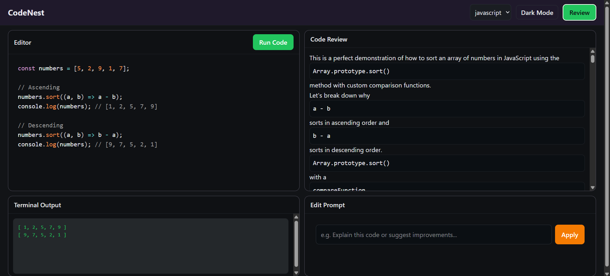

# 🚀 CodeNest: The AI-Augmented Hybrid IDE

CodeNest is a next-generation, high-performance web-based IDE that combines traditional coding with advanced AI capabilities. It features real-time AI logic analysis, visual code flow generation, and a robust server-side file management system.



## 🌟 Key Features

### 1. **Intelligence Engine (Groq-Powered)**
- **Blazing Fast AI:** Utilizes the Groq LPU™ Inference Engine with `llama-3.3-70b-versatile` for near-instant code reviews and visualizations.
- **Live AI Review:** Analyzes your code logic in real-time, identifying potential bugs, security vulnerabilities, and optimization opportunities.
- **Visual Code Flow:** Automatically generates interactive Mermaid.js diagrams to visualize your code's execution path and architecture.

### 2. **Industry-Grade Security (Isolated Runner)**
- **Sandboxed Execution:** Code execution is moved to a separate, isolated Docker container (`runner`) that has no network access.
- **Resource Throttling:** Mandatory 5-second timeouts and strict CPU/Memory limits (0.5 CPU, 256MB RAM) prevent resource abuse.
- **Microservices Architecture:** The main web server is stripped of all compilers, making it more secure and lightweight.

### 3. **Professional Project Management**
- **Disk-Based Persistence:** Unlike traditional web IDEs that use browser storage, CodeNest persists your projects directly to a Docker volume.
- **Multi-File Support:** Create complex folder structures and switch between files seamlessly.
- **ZIP Export:** Download your entire project as a production-ready `.zip` archive.

### 4. **Advanced Developer Tools**
- **Time-Travel Snapshots:** Automatically saves snapshots of your code. View historical versions and perform **side-by-side diff analysis** to see exactly what changed.
- **AI Debug Mode:** When code execution fails, the AI analyzes the terminal output and suggests an automated fix.
- **Interactive Visualization:** High-quality PNG exports and interactive zoom/pan for architectural diagrams.

### 5. **Modern UI/UX**
- **Glassmorphism Design:** A stunning, premium interface built with Tailwind CSS 4, featuring backdrop blurs and subtle micro-animations.
- **Adaptive Themes:** Full dark/light mode support with reactive components that adjust their appearance dynamically.

---

## 🛠️ Tech Stack

### **Frontend**
- **React 19 & Vite:** Lightning-fast development and optimized production builds.
- **Tailwind CSS 4:** Modern styling with full dark mode support.
- **Mermaid.js:** SVG-based diagram generation.
- **React-Zoom-Pan-Pinch:** Interactive controls for complex visualizations.
- **Zustand:** Lightweight state management for projects and versions.

### **Backend**
- **Node.js & Express:** Robust server architecture.
- **Groq SDK:** High-speed AI inference integration.
- **fs-extra:** Advanced file system operations.
- **Archiver:** Efficient ZIP compression for project exports.

---

## 📁 Project Structure & File Details

### **Frontend (`/Frontend`)**
- **`src/App.jsx`**: The core application orchestrator. Manages layout, global state, and integration between all panels.
- **`src/components/`**:
    - `EditorPanel.jsx`: A specialized code editor wrapper using `react-simple-code-editor` with syntax highlighting and language-aware styling.
    - `ReviewPanel.jsx`: A dual-mode panel that renders AI markdown feedback and interactive Mermaid diagrams.
    - `ProjectSidebar.jsx`: Advanced file tree with inline renaming, creation, and project downloads.
    - `TerminalPanel.jsx`: Simulates a terminal environment for execution output and AI-powered debugging.
    - `VersionTimeline.jsx`: A visual history of your code changes with diff comparison capabilities.
    - `LandingPage.jsx`: A premium, animated entry point for the application.
- **`src/hooks/`**:
    - `useProjectStore.js`: Manages the server-synced file system state.
    - `useVersionStore.js`: Handles code snapshots and history.

### **Backend (`/Backend`)**
- **`server.js`**: The entry point that initializes the Express server and loads environment configurations.
- **`src/services/`**:
    - `ai.services.js`: Encapsulates logic for Groq API calls, prompt engineering, and Mermaid syntax validation.
    - `project.services.js`: Handles disk I/O, folder management, and ZIP creation.
- **`src/routes/`**:
    - `ai.routes.js`: API endpoints for code review, debugging, and visualization.
    - `project.routes.js`: Endpoints for CRUD operations on files and project downloads.
- **`projects/`**: The root directory where user projects are physically stored on the disk.

---

## 🚀 Getting Started

### 1. Prerequisites
- Node.js (v18+)
- A Groq API Key (Get it at [console.groq.com](https://console.groq.com/))

### 2. Installation
```bash
# Clone the repo
git clone https://github.com/Suvradip01/CodeNest.git
cd CodeNest

# Install Backend dependencies
cd Backend
npm install

# Install Frontend dependencies
cd ../Frontend
npm install
```

### 3. Configuration
Create a `.env` file in the `Backend` directory:
```env
PORT=3000
GROQ_API_KEY=your_api_key_here
```

### 4. Run the App
```bash
# Start Backend (from /Backend)
npm start

# Start Frontend (from /Frontend)
npm run dev
```

---

## 🛡️ License
Distributed under the MIT License. See `LICENSE` for more information.

## 👨‍💻 Author
**Suvradip Ghosh** - [GitHub](https://github.com/Suvradip01)
