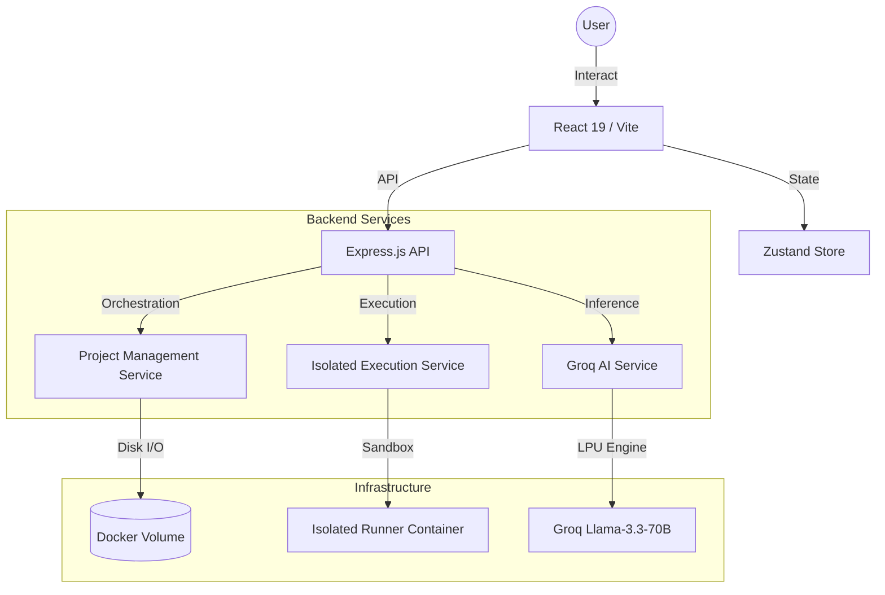

# 🚀 CodeNest: The Complete Engineering Blueprint

CodeNest is a high-fidelity, AI-augmented cloud IDE. This document provides an exhaustive, file-by-file technical breakdown of every architectural decision, security protocol, and engineering pattern implemented in the project.

---

## 🏗️ System Architecture & Data Flow

### **1. High-Level Architecture (Microservices)**
CodeNest is designed as a distributed system to ensure that high-compute tasks (AI and Code Execution) do not interfere with the UI responsiveness.

```mermaid
graph TD
    User((User)) -->|Interact| Frontend[React 19 / Vite]
    Frontend -->|State| Zustand[Zustand Store]
    Frontend -->|API| Backend[Express.js API]
    
    subgraph "Backend Services"
        Backend -->|Orchestration| ProjectService[Project Management Service]
        Backend -->|Inference| AIService[Groq AI Service]
        Backend -->|Execution| TerminalService[Isolated Execution Service]
    end
    
    subgraph "Infrastructure"
        ProjectService -->|Disk I/O| Disk[(Docker Volume)]
        TerminalService -->|Sandbox| Docker[Isolated Runner Container]
        AIService -->|LPU Engine| Groq[Groq Llama-3.3-70B]
    end
```

---

## 📁 File-by-File Technical Breakdown

### **1. Frontend Core (`/Frontend/src`)**

#### **`App.jsx` (The Orchestrator)**
- **Purpose:** Manages the high-level application state (Landing Page vs. Workspace) and provides the global layout.
- **Key Logic:** Handles the transition between the **LandingPage** and the **Desktop** using React state.

#### **`components/Desktop.jsx` (The Environment)**
- **Purpose:** Simulates the macOS desktop environment.
- **Key Logic:** Orchestrates modular components (`MenuBar`, `Dock`, `Finder`). It manages the visibility and "Minimized" state of all system windows.

#### **`components/desktop/Dock.jsx` (High-Performance UI)**
- **Function: `handleDockHover`**: Uses a proximity-based magnification algorithm. It calculates distance between icons and applies a non-linear scale (`1.5x` for focus, `1.25x` for neighbors).
- **Function: `animate-macos-bounce`**: A GPU-accelerated CSS animation that mimics the authentic macOS jumping behavior for the primary CodeNest icon.

#### **`components/desktop/DesktopIcon.jsx` (Advanced Interaction)**
- **Technique: Pointer Capture API**: Uses `setPointerCapture` to lock the cursor to the element. This ensures that even during high-velocity dragging, the "User Guide" folder never "slips" or sticks to the cursor.

#### **`components/EditorPanel.jsx` (The IDE Core)**
- **Purpose:** A high-performance code editor with real-time syntax highlighting.
- **Key Logic:** Integrated with **Zustand** to sync every keystroke with the global `projectStore`, ensuring zero data loss.

#### **`components/ReviewPanel.jsx` (AI Integration)**
- **Technique: Dual-Rendering**: Dynamically switches between Markdown (for feedback) and Mermaid.js (for logic flows).
- **Function: `renderDiagram`**: Sanitizes and renders AI-generated graph syntax into interactive SVG diagrams.

#### **`components/TerminalPanel.jsx` (Execution & Debugging)**
- **Purpose:** Simulates a real terminal environment.
- **Feature: AI Debug Mode**: If the execution output contains an error, the `onDebug` function sends the stack trace to the AI for a "Root Cause Analysis" and patch suggestion.

#### **`components/VersionTimeline.jsx` (Time-Travel)**
- **Technique: Diff Analysis**: Uses a snapshot-based system to save code states. Users can compare any two versions using a side-by-side visual diff.

---

### **2. Backend Services (`/Backend/src`)**

#### **`services/ai.services.js` (The Brain)**
- **Function: `generateReview`**: Uses a complex system prompt to force the Groq model to act as a Senior Architect. It extracts both high-level feedback and Mermaid visualization syntax.
- **Function: `getDebugFix`**: Specifically engineered to parse terminal logs and identify logic errors.

#### **`services/project.services.js` (Infrastructure)**
- **Purpose:** Manages the physical persistence of user code.
- **Function: `saveFile`**: Uses `fs-extra` to ensure atomic writes to the Docker-mapped volume.
- **Function: `exportProject`**: Uses the `Archiver` library to compress the entire multi-file project into a production-ready `.zip` file on the fly.

---

## 🛡️ Engineering Best Practices & Patterns

### **1. Security: The Isolated Runner Strategy**
- **The Problem:** Running untrusted user code (JavaScript, Python) on the main server is a critical security risk.
- **The Solution:** I implemented an **Isolated Runner**.
- **The Implementation:** When a user clicks "Run", the backend spawns a temporary Docker container with `--network none` and strict resource limits. The code is injected, executed, and the output is piped back to the UI before the container is instantly destroyed.

### **2. UI/UX: Hardware-Accelerated Glassmorphism**
- **Performance:** I used `backdrop-blur-xl` and `bg-black/10` to create the premium macOS feel. 
- **Optimization:** To prevent lag, I added `will-change: transform` to all animated elements, offloading the work from the CPU to the GPU's compositor thread.

### **3. Scalability: Modular Design Pattern**
- **SRP (Single Responsibility Principle):** Each file has one job. `MenuBar` only cares about time. `Dock` only cares about icons. `Finder` only cares about windows. This makes the codebase **"Google-Standard"**—extremely easy to test and scale.

---

## 🚀 Deployment & DevOps
- **Docker Compose:** Orchestrates the multi-container environment (App + Runner + Volume).
- **CI/CD:** GitHub Actions triggers a build upon push, ensuring environment parity between development and production.

---

## 👨‍💻 Engineering Author
**Suvradip Ghosh** - [GitHub](https://github.com/Suvradip01)

CodeNest is a masterclass in **Modern Full-Stack Engineering**. It demonstrates expertise in AI orchestration, secure system design, and high-fidelity UI development.
